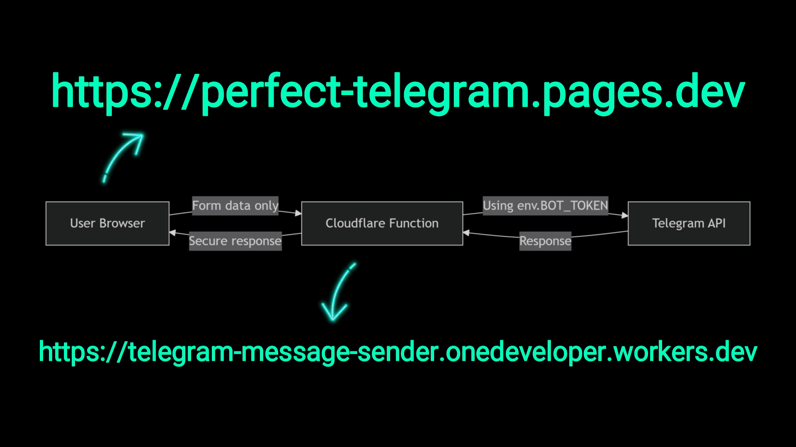

# Submit Website Contact Form to Telegram Chat
_Telegram Bot Development & API Course: Send HTML Form Data from Your Website to Telegram!_

### 📐 System Architecture Diagram

*Figure: End-to-end data flow architecture for secure form submission to Telegram*

## 📬 About This Repository
A comprehensive developer-focused tutorial series that walks you from client-side form demos to a secure, production-ready serverless pipeline for sending website form data to Telegram.

### What You'll Learn
This complete tutorial series covers:
- **Three Form Implementations**: Complex Version, Simple Version, and Image Upload Support Version
- **Telegram Bot Setup**: Creating and configuring a bot with BotFather
- **Client-Side JavaScript**: Form handling with fetch API and FormData
- **Serverless Backend**: Implementing Cloudflare Workers for secure API communication
- **Security Best Practices**: Protecting BOT_TOKEN and CHAT_ID from client-side exposure
- **Production Deployment**: Full deployment pipeline using Cloudflare Workers and Pages

### Tutorial Series Breakdown
This comprehensive series consists of 6 episodes that guide you through the entire process:

#### Episode 1: Form Demos
- Overview of three form implementations (Complex, Image Upload Support, Simple)
- Live testing of each form version
- Understanding data flow from form to Telegram

#### Episode 2: Telegram Bot Setup
- Creating a Telegram bot using BotFather
- Obtaining and securing your BOT_TOKEN
- Getting your CHAT_ID with userinfobot
- Bot configuration best practices

#### Episode 3: Client-Side Implementation
- HTML form structure and JavaScript integration
- Form data extraction and validation
- Implementing Telegram API calls from the client
- Image handling with base64 encoding
- Security considerations of client-side implementation

#### Episode 4: Cloudflare Worker Introduction
- Understanding security vulnerabilities of client-side tokens
- Creating your first Cloudflare Worker
- Setting up Wrangler CLI
- Securing environment variables (BOT_TOKEN, CHAT_ID)
- Deploying and testing your worker

#### Episode 5: Server-Side Implementation
- Updating frontend to communicate with Worker
- Implementing CORS and OPTIONS preflight handling
- Processing FormData server-side
- Sending messages to Telegram API from the Worker
- Error handling and response formatting

#### Episode 6: Production Deployment
- Preparing frontend for Cloudflare Pages
- Deploying frontend to Cloudflare Pages
- Updating Worker to accept requests from Pages
- Final testing and production considerations

### Key Features
✅ **Three Progressive Implementations**:
- **Simple Version**: Basic form-to-Telegram integration  
- **Complex Version**: Advanced features with validation & formatting  
- **Image Upload Support Version**: Handle file attachments seamlessly  

✅ **Security-First Approach**:
- Protect sensitive tokens using Cloudflare Workers
- Implement proper CORS handling
- Environment variable management
- Origin validation

✅ **Complete Deployment Pipeline**:
- Frontend deployment to Cloudflare Pages
- Backend deployment to Cloudflare Workers
- Seamless integration between components

### Prerequisites
Before starting this tutorial series, ensure you have:
- Basic knowledge of HTML and JavaScript
- A Telegram account
- Node.js and Wrangler CLI installed

---

## 🎥 Tutorial Video
🔗 ***[https://youtu.be/aRREKXloWe8](https://youtu.be/aRREKXloWe8)***  
*Complete step-by-step guide covering all 6 episodes*

### Video Timestamps
#### Episode 1: Form Demos
- **0:00** - Intro
- **0:20** - Welcome - series overview and goals
- **1:07** - Episode 1 - Demo: 3 form versions (Complex / Image-support / Simple)
- **1:45** - Test Form 1 - fill, select image, submit
- **2:34** - Form 1 message received - inspect payload
- **3:03** - Test Form 2 - image uploaded and optimized delivery
- **3:52** - Test Form 3 - simple raw-data form
- **4:14** - Episode 1 wrap and next steps

#### Episode 2: Telegram Bot Setup
- **4:35** - Episode 2 - Create Telegram bot and get Chat ID (BotFather + userinfobot)
- **5:05** - Bot settings and privacy tips (avoid Telegram logo; username must end with "bot")
- **6:12** - Copy bot token and save securely
- **6:34** - Get chat ID with userinfobot - why token and chat ID matter
- **7:32** - Episode 2 wrap

#### Episode 3: Client-Side Implementation
- **7:47** - Episode 3 - Connect chosen form to Telegram API using JS (image-upload version)
- **9:01** - HTML form structure and app.js inclusion
- **9:17** - DOM element selection and variables in JS
- **9:54** - Define submit handler - preventDefault, disable button
- **10:45** - try / catch / finally flow for UX and error handling
- **11:53** - Extract FormData and prepare payload
- **12:12** - Client-side BOT_TOKEN and CHAT_ID demo (insecure - learning only)
- **13:24** - Define Telegram API endpoint and sendMessage fetch request
- **14:03** - Fetch request details - headers and JSON body
- **15:09** - Image validation - type and 5 MB limit
- **15:45** - Prepare photo FormData and sendPhoto flow (base64 or form-data)
- **16:55** - UI success message, reset form, clear preview
- **17:32** - Live tests - text and image delivered from client demo
- **18:52** - Security warning - client-side secrets exposed in DevTools
- **19:35** - Episode 3 wrap - next: secure backend with Cloudflare

#### Episode 4: Cloudflare Worker Introduction
- **20:00** - Episode 4 - Why you need a server; Cloudflare Worker intro
- **20:30** - Demo - how BOT_TOKEN and CHAT_ID leak via DevTools Network tab
- **23:19** - Create Worker project, worker JS, and wrangler.toml config
- **25:26** - Install Wrangler and deploy test worker (login to wrangler deploy)
- **28:50** - Set environment variables (BOT_TOKEN, CHAT_ID) via Wrangler or dashboard
- **30:26** - Redeploy worker to inject env vars securely
- **30:52** - Episode 4 wrap

#### Episode 5: Server-Side Implementation
- **31:05** - Episode 5 - Implement Telegram API inside the Worker (server-side)
- **32:03** - Update frontend to POST to Worker URL (no secrets on client)
- **33:45** - Worker structure - event listener to handleRequest (ES module)
- **34:22** - CORS and OPTIONS preflight handling; origin validation
- **36:13** - Extract FormData, format message, and sendMessage from Worker
- **37:33** - Send image from Worker to Telegram via sendPhoto
- **38:38** - Worker returns JSON success or error with CORS headers
- **39:01** - Deploy updated worker; debug common runtime errors (quotes/backticks, case)
- **40:38** - Test - message and image delivered; BOT_TOKEN and CHAT_ID not visible in network tab
- **41:04** - Security recap - env vars hidden in Cloudflare dashboard

#### Episode 6: Production Deployment
- **42:10** - Episode 6 - Deploy frontend to Cloudflare Pages and link to Worker
- **42:46** - Prepare Pages project, public/ output, and wrangler.pages config
- **43:13** - Use two terminals for Pages and Worker; set Pages build output dir
- **44:44** - Deploy Cloudflare Pages (wrangler pages deploy)
- **45:22** - Pages appears in dashboard - site link visible
- **46:05** - Update Worker allowed origin to Pages URL and redeploy worker
- **47:02** - Final live tests from Pages - text and image delivered successfully
- **48:04** - Production notes - env var behavior and checklist
- **49:28** - Outro

---

## 🛠️ Useful Links

### Cloudflare Dashboard
🔗 https://dash.cloudflare.com/

### Source Code (All Versions Included)
🔗 https://github.com/saeedkohansal/send-form-to-telegram

### Deployment Guides
- **Worker Deployment**: 
  🔗 https://github.com/saeedkohansal/send-form-to-telegram/blob/main/source-code/Image%20Upload%20Support%20Version%20%2B%20Cloudflare%20Workers/Worker/HOW-TO-DEPLOY.txt
- **Pages Deployment**: 
  🔗 https://github.com/saeedkohansal/send-form-to-telegram/blob/main/source-code/Image%20Upload%20Support%20Version%20%2B%20Cloudflare%20Pages/HOW-TO-DEPLOY.txt

---

## 💖 Support This Project
If you find this content valuable, please consider supporting my work! 😍🙏

**💙 PAYPAL DONATION**  
https://paypal.me/gilgeekify

**❤️ PATREON**  
https://www.patreon.com/gilgeekify

**💛 BUY ME A COFFEE**  
https://www.buymeacoffee.com/gilgeekify

**🪙 My Public Address To Receive BTC • Bitcoin**  
bc1qerc5ev074cqknu9nz589w4vjf5ecmhuc2df83h

**🥈 My Public Address To Receive ETH • Ethereum**  
0x566A47B9731209A5144336D274D44224bfb9C0ea

---

## 📢 Support the Channel
👍 Like | 💬 Comment | 🔔 Subscribe & Hit the Bell

#TelegramBot #CloudflareWorker #WebDevelopment #JavaScriptTutorial #gilgeekify
