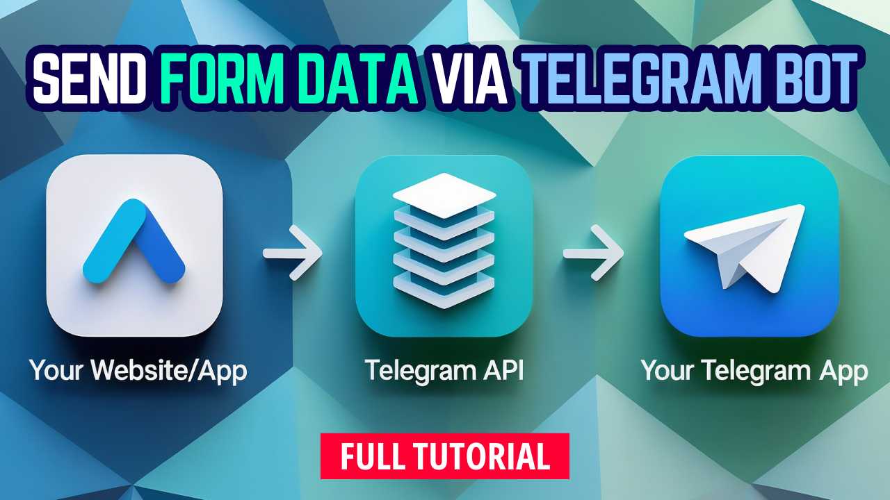

# Submit Website Contact Form to Telegram Chat

_Telegram Bot Development & API Course: Send HTML Form Data from Your Website to Telegram!_

Learn how to send data from your website forms to Telegram using JavaScript and the Telegram Bot API! This series covers three demo versions: Complex Version, Simple Version, and Image Upload Support Version. You'll see how to securely connect your frontend with Telegram via Cloudflare Workers and Pages, protect sensitive data like BOT TOKEN and CHAT ID, and handle text and image submissions. Perfect for web developers looking to integrate Telegram messaging into their websites. Watch and learn step-by-step!

# 🎥 Tutorial Video
🔗 ***[https://youtu.be/eIxkX-J1K-4](https://youtu.be/kOpSqUIpZhQ)*** | *Step-by-step guide*

 

## If you enjoy my content, please consider supporting me! 😍🙏

**💙 PAYPAL DONATION**

https://paypal.me/gilgeekify

**❤️ PATREON**

https://www.patreon.com/gilgeekify

**💛 BUY ME A COFFEE**

https://www.buymeacoffee.com/gilgeekify

**🪙 My Public Address To Receive BTC • Bitcoin**

bc1qerc5ev074cqknu9nz589w4vjf5ecmhuc2df83h

**🥈 My Public Address To Receive ETH • Ethereum**

0x566A47B9731209A5144336D274D44224bfb9C0ea
